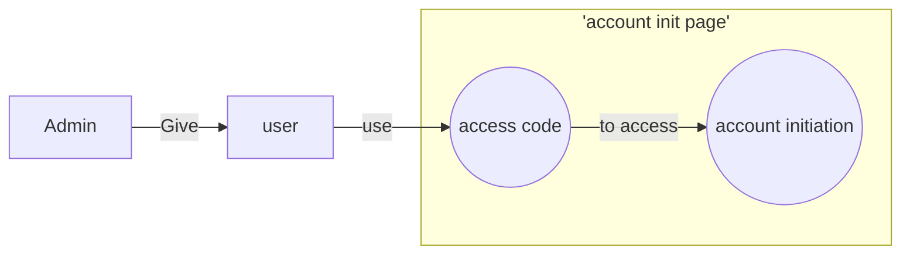
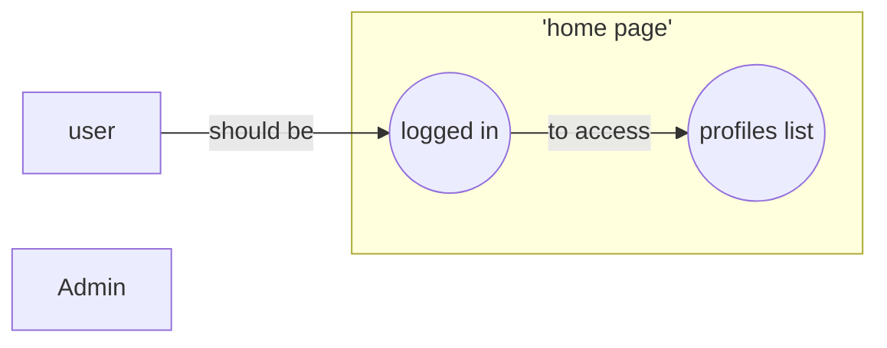
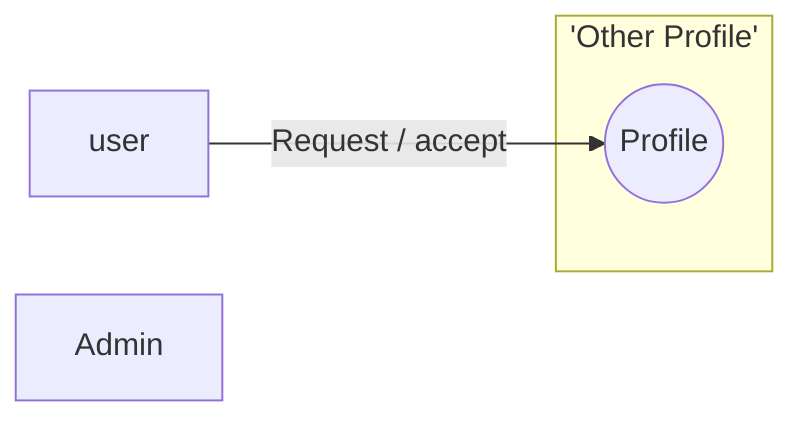
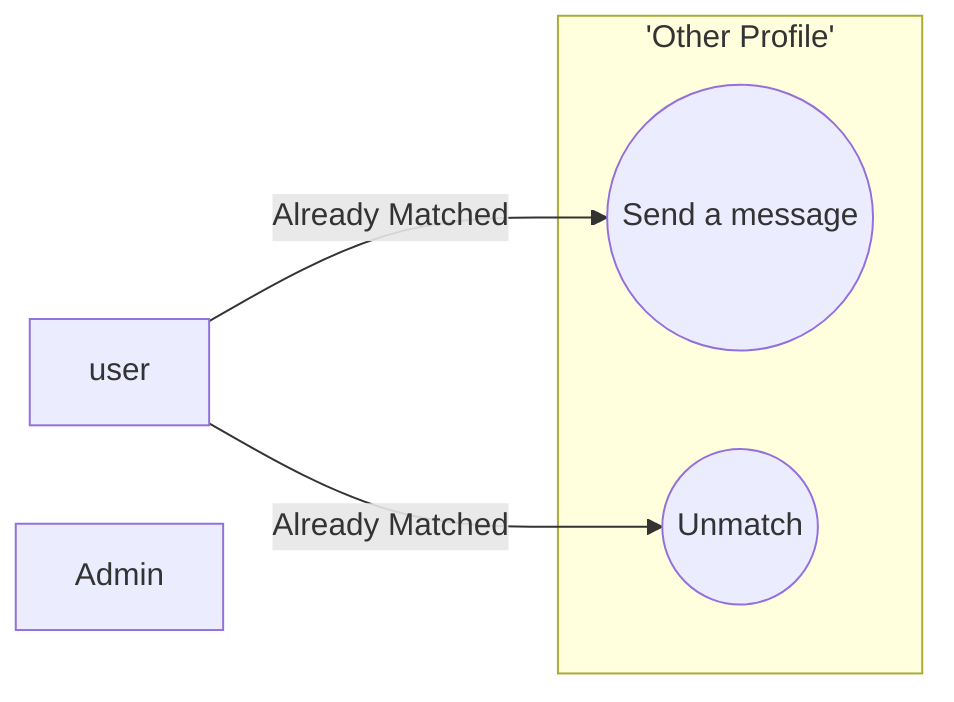
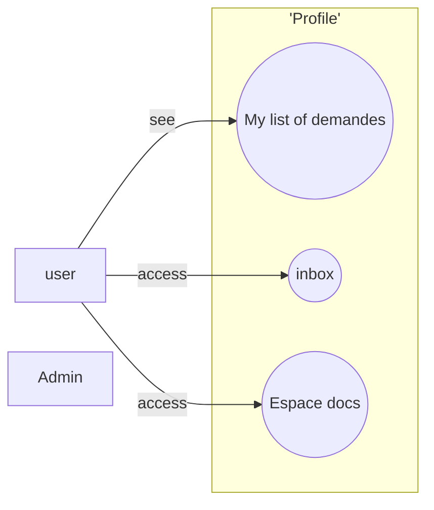
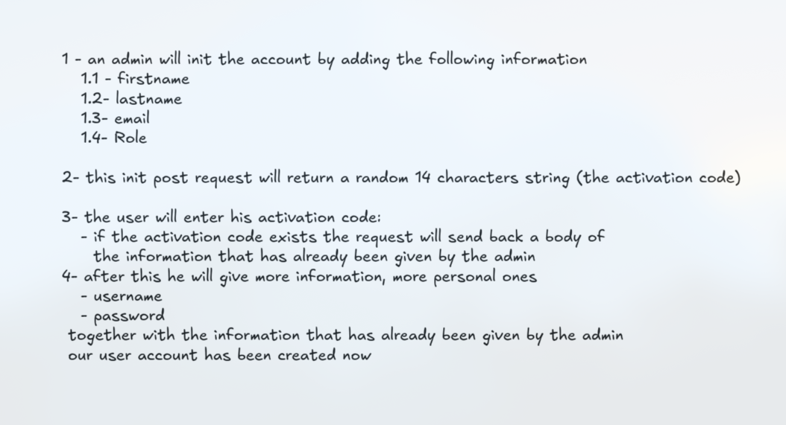
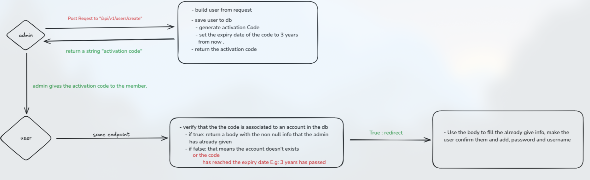

```mermaid
flowchart LR
    subgraph 'account init page'
    uc1((access code))
    uc2((account initiation))

    end
    user[user]
    admin[Admin]


    admin --Give--> user
    user --use--> uc1
    uc1 -- to access --> uc2
```

```mermaid
flowchart LR
    subgraph 'home page'
    uc1((logged in))
    uc2((profiles list))

    end
    user[user]
    admin[Admin]

    user -- should be --> uc1
    uc1 -- to access --> uc2
```

```mermaid
flowchart LR
    subgraph 'Other Profile'

    uc2((Profile))

    end
    user[user]
    admin[Admin]

    user --Request / accept--> uc2

```

```mermaid
flowchart LR
    subgraph 'Other Profile'
        uc1((Send a message))
        uc2((Unmatch))

    end
    user[user]
    admin[Admin]

    user -- Already Matched--> uc1
    user --Already Matched--> uc2

```

```mermaid
flowchart LR
    subgraph 'Profile'
    uc1((My list of demandes))
    uc2((inbox))
    uc3((Espace docs))
    end
    user[user]
    admin[Admin]


  
    user --see--> uc1
    user --access--> uc2
    user --access--> uc3
```

