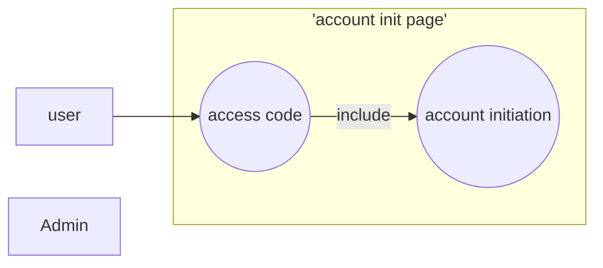
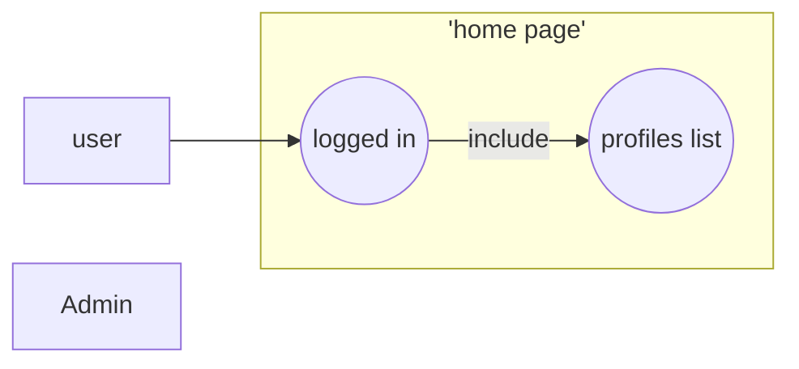
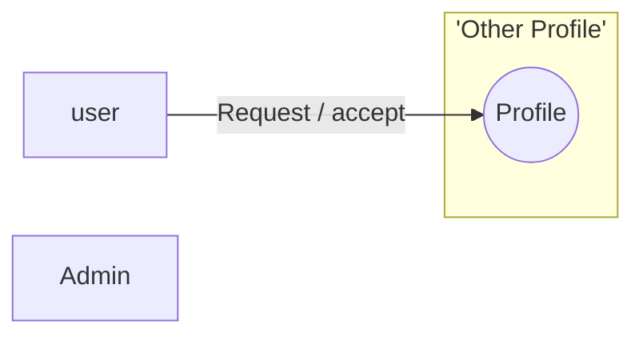
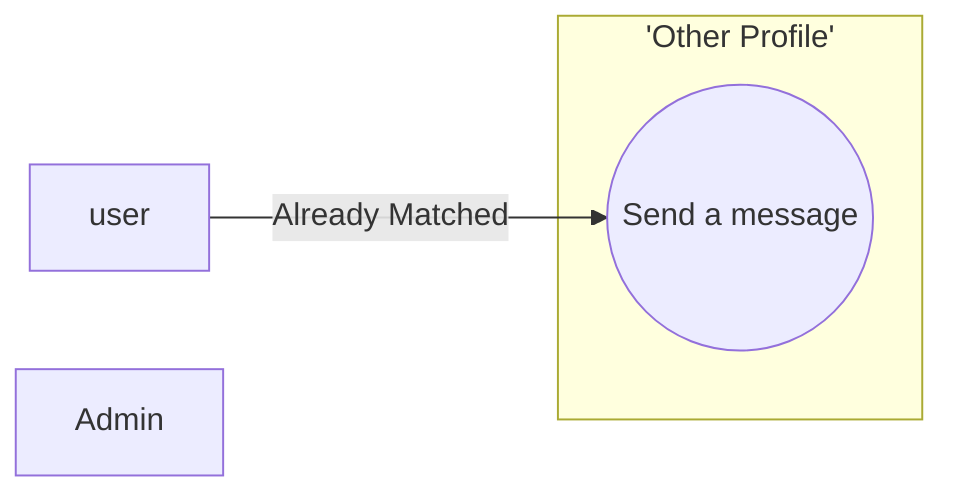
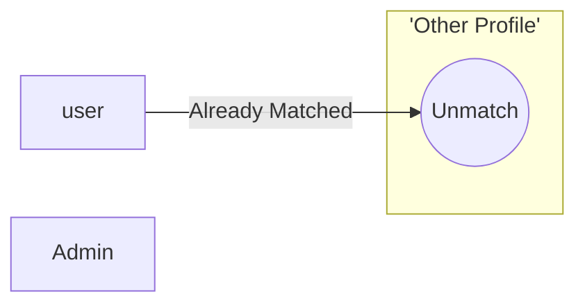

```mermaid
flowchart LR
    subgraph 'account init page'
    uc1((access code))
    uc2((account initiation))

    end
    user[user]
    admin[Admin]


    user --> uc1
    uc1 -- include --> uc2
```

```mermaid
flowchart LR
    subgraph 'home page'
    uc1((logged in))
    uc2((profiles list))

    end
    user[user]
    admin[Admin]

    user --> uc1
    uc1 -- include --> uc2
```

```mermaid
flowchart LR
    subgraph 'Other Profile'

    uc2((Profile))

    end
    user[user]
    admin[Admin]

    user --Request / accept--> uc2

```

```mermaid
flowchart LR
    subgraph 'Other Profile'

    uc2((Send a message))

    end
    user[user]
    admin[Admin]

    user --Already Matched--> uc2

```

```mermaid
flowchart LR
    subgraph 'Other Profile'

    uc2((Unmatch))

    end
    user[user]
    admin[Admin]

    user --Already Matched--> uc2

```